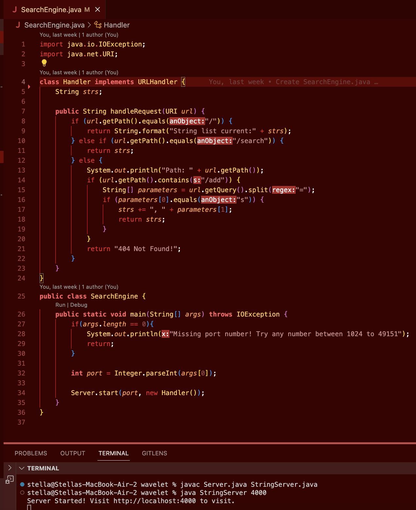
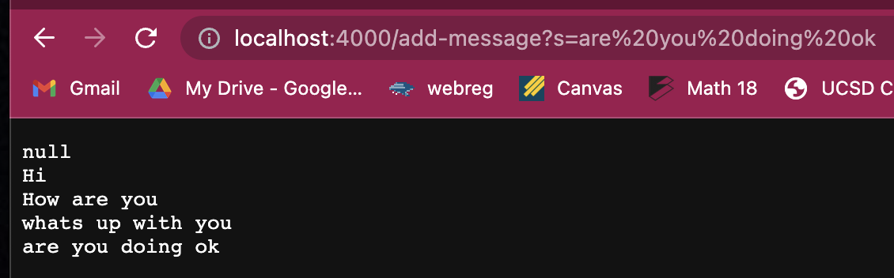
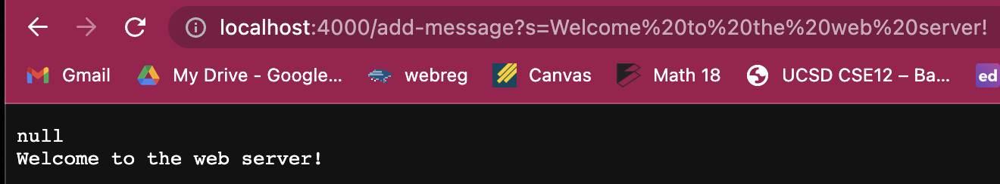

# Lab Report 2: Servers and Bugs
## Part 1: StringServer
writing a web server (StringServer) takes path in the formate shown below:
```
/add-message?s=<string>
```
This results in the concatenation of a new line (```\n```) and the <string> input after the =, resulting in a runnign string remembering previous input. 
### The code for the StringServer is below:

It is compiled using:
```
⤇ javac Server.java StringServer.java 
⤇ java StringServer 4000
Server Started! Visit http://localhost:4000
```
### Some examples of the code taking commands are as pictured below:
1. 
- The main method in StringServer creates a Handler object to access the handleRequest method which processes the path: ```/add-message?s=<string>```
- The handleRequest method take a URL as an arguement and searches the URL to for the path beggining ```\``` then splits the query ```s=<string>``` 
and saves the string starting after the ```=```, which is the message.
 ---
in this example, the value of the arguement passed into the handleRequest method is ```localhost:4000/add-message?s=are you doing ok```
the value for the query is ```s=are you doing ok``` containing the message to be added ```are you doing ok```
- These messages are stored in the feild strs which holds information about the new message appened to the old messages.
in this example, the value of strs before the request was ```null
                                                             Hi
                                                             How are you
                                                             whats up with you```
the value to be appended to strs is ```are you doing ok``` as that was the message in the query as previously described. 

2. 
in this example, the value of the arguement passed into the handleRequest method is ```localhost:4000/add-message?s=Welcome to the web server!```
the value for the query is ```s=Welcome to the web server``` containing the message to be added ```Welcome to the web server!```
in this example, the value of strs before the request was ```null``` and after the request it was ```null
                                                                                                     Welcome to the web server!```
  
## Part 2: Bugs
When running the reversedInPlace() method origionally there was a bug in the code that caused ilogical results.
All inputs besides an array of length 1 will be failure inducing as if there is only one element nothing is switched. 
The JUnit test are compiled and run using the commands:
```
local $ javac -cp .:lib/hamcrest-core-1.3.jar:lib/junit-4.13.2.jar *.java
local $ java -cp .:lib/hamcrest-core-1.3.jar:lib/junit-4.13.2.jar org.junit.runner.JUnitCore ArrayTests
```
## The folloiwing JUnit test fails:
```
   @Test
   public void testReverseInPlaceBugFail(){
      int[] input = {1,2,3,4};
      int[] output = {4,3,2,1};
      ArrayExamples.reverseInPlace(input);
      assertArrayEquals(output, input);
   }
```
The input that doesn't induce failure is the Array with only one element as nothing needs to be reverse/swapped. 
## The following JUnit test passes:
```
   @Test
   public void testReverseInPlaceBugPass(){
      int[] input = {1};
      assertArrayEquals(input, ArrayExamples.reverseInPlace(input));
   }
``` 
The sypmtoms of these test failures is illogical output, the symptom for the failure test above is {4, 3, 3, 4}. 
The failure output is shown below:

## The ReverseInPlace() method with the bug is shown below:
``` 
   static void reverseInPlace(int[] arr) { //only need to change up until half way bc of swapping
    for(int i = 0; i < arr.length; i += 1) {
      arr[i] = arr[arr.length - i - 1];
    }
   }
``` 
- This method access the right indexes in the array in the right order but has the wrong values stored at those indexes as the method switches the 
element before storing the element replaced into a temp variable therefore the data at that index is lost. For example, when the loop finds the last value it assigns it to the first place in Array (index 0) which looses the information about the origional element at index 0 so it ends up being a symmetrical mirror array.
## The Fixed ReverseInPlace() method is show below:
``` 
  static void reverseInPlace(int[] arr) { //only need to change up until half way bc of swapping
    for(int i = 0; i < arr.length/2; i += 1) {
      int temp = arr[i]; //origional didn't have a temp variable
      arr[i] = arr[arr.length-1 - i];
      arr[arr.length-1 - i] = temp; //swapping the two numbers
    }
  }
``` 
- This bug was fixed by adding a temp varaible and looping through only the first half of the array because a switch will inherinetly update the second half as values are reversed.
# Part 3: Learnings
- Throughout this lab I have learned how to use JUnit test in VSCode. My previous expereince with JUnit has been in Eclipse which runs the terminal commands internally. I also learned how to set up a web server which I had no previous knowledge on. 
